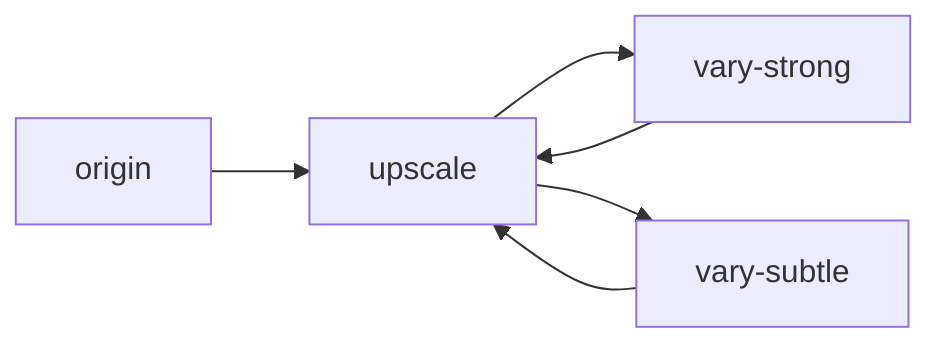

# 生成式AI對話生圖Linebot機器人

- 背後與ChatGPT及Midjourney API串接，支持三大功能
	 
	- 文本對話：透過自然語言對話，針對問題答覆
	- 圖片分析：可傳送照片及一組問題，針對圖中內容進行回答
		> 支持Vision功能，透過OpenAI最新釋出模型GPT4進行分析(暫用低解析度模式)
	- 圖片生成：透過一段文字描述，生成對應圖片
   	

- 整合於Line環境中，可直接於對話介面上使用，無須切換至不同服務商的操作環境（如Midjourney須透過Discord）
- 基於Line Messaging API接收事件，透過不同的訊息類型進行調控，並以合適的Line元件推送至用戶端呈現
- 可應對不同API的互動模式，除了當下即同步取得結果，亦可異步處理
    - ChatGPT API: 發出請求當下，伺服端隨即同步回傳結果
    - Discord(Midjourney) API: 發送生成請求後，透過polling，在訊息列表中自行比對資訊，擷取對應的生成結果
- 設計通用的數據存放格式，能因應不同業者所制定API版本間的差異(如gpt3.5及gpt4涉及的參數及結構不同)保存處理
- 將文字及圖片數據存於私人資料庫上，可供備存及日後其他應用開發或探勘用途


## ChatGPT聊天對話控制


- 每則話題進行前可設定系統的指示，供ChatGPT了解背景需求情境，例如可要求對話盡可能簡潔。
- ChatGPT之所以具記憶回溯能力，是由於整段歷史對話會不斷疊加傳送至OpenAI伺服端，我們分別可透過dialog_count及dialog_order來區分每一段話題及各則對話。但由於傳輸的字數token越多、花費的API費用越高，因此需適時「開新話題」以利從零計數。
- gpt4版本增加了可解析圖片的功能，但也造成原本純文字的格式須轉為可同時接收圖片及文字。針對複合格式，設計一訊息類型為"extension" type，來表示一組圖片+文字。


## Midjourney圖像生成流程

起始origin生成時需提供可透過一段「提示詞」，每次會產生4張候選圖片，可upscale查看圖片細節、針對某圖做更細緻化處理；後續則可進一步變化，如大幅變化(vary strong)、輕微變化(vary suble)等。
> 其他變化如zoom in、zoom out暫不支持。


在Midjourney中，整個圖像生成流程可描述為下列的狀態變化：

共有origin、upscale、vary等生成紀錄類型，且origin及vary均會導向upscale。


### 資料儲存結構
由於Midjourney圖像生成屬「異步」處理，發送請求後需靜候一段時間，待Discord Server處理完畢才能進一步取得完整資訊，因此設計數據儲存採「兩段式」：(1)create先建立該紀錄 ➝ (2)patch取得完整資訊後再填入。


所有類型(origin、upscale、vary)均經歷四個函式：create_image() ➝ send_request() ➝ parse_components() ➝ patch_image()
> send_request()又因應不同類型拆分為send_origin_request()及send_option_request()，這是由於非origin類型須額外記存reference來源

其中origin及vary類型在parse_components()階段，會進一步產生4個執行緒，個別追蹤4張候選圖的upscale細節資訊。

---

## 事前準備及必備資訊
1. LINE頻道建立: 於Line Develop Console建立基於Messaging API的頻道，啟用webhook並取得Channel access token
2. SSL憑證獲取: 由於Line webhook僅支援https通訊，故自架server端需持有SSL憑證
3. ChatGPT金鑰獲取: 登入OpenAI網站，在API Keys的分頁中發行一次性金鑰(需事先註冊信用卡，消費存入點數才能使用API)
4. Discord頻道建立+驗證碼擷取: 於Midjourney網站訂閱方案，且與Discord進行綁定，於Discord另建app加入Midjourney bot後確保可正常使用/imagine功能

在template資料夾中的三個檔案開頭有需填入的變數，請將`...`的部分填入自身資料：

- [X] line_template.py #4:
```python
LINE_AUTH_HEADER = {"Authorization" : "Bearer ..."}
```

- [X] openai_template.py #5:
```python
OPENAI_AUTH_HEADER = {'Authorization' : 'Bearer ...', 'OpenAi-Organization' : '...'}
```

- [X] discord_template.py #4-5, #10:
```python
GUILD_ID = "..."
CHANNEL_ID = "..."
DISCORD_AUTH_HEADER = {'Authorization' : '...'}
```

## 程式環境安裝

由於LINE只接受https協定需開在443 port，而像是80及443等重要埠號需要root的權限才能占用，可透過authbind等工具協助執行：
```
sudo apt-get install authbind
sudo touch /etc/authbind/byport/443
sudo chmod 777 /etc/authbind/byport/443
```

主要伺服程式是在webhook.py，在最後面可修改執行配置設定，並且指定SSL憑證的位置：
```python
if __name__ == '__main__':
    app.run(host="0.0.0.0", port=int(443), ssl_context=('../ssl/chained.crt', '../ssl/private.key'), debug=True, threaded=True)
```

最後可透過authbind來執行python檔：
```
cd ./src/
authbind --deep python3 webhook.py
```
